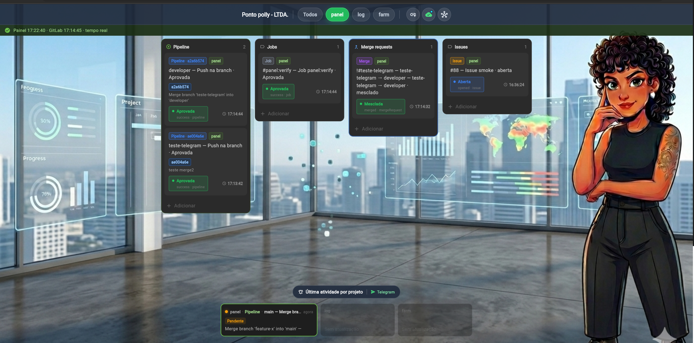
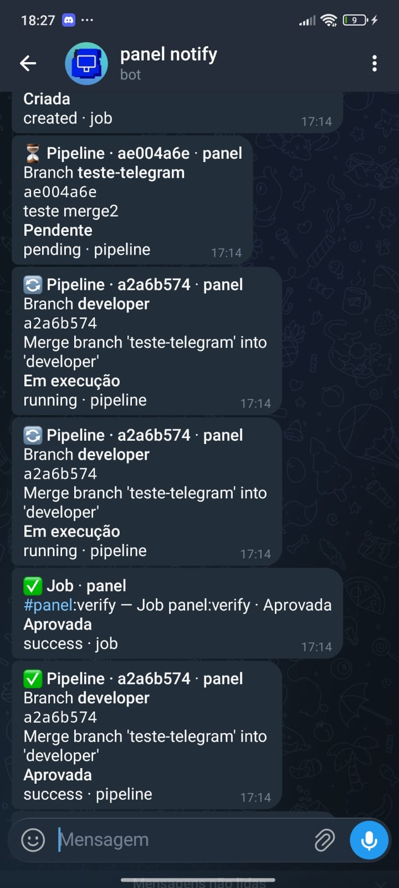

# Panel


**Centralizar tudo em um único lugar e reduzir o tempo entre o problema acontecer e o time perceber.**

Painel de monitoramento em tempo real para times que vivem no GitLab: push, CI, merge requests e issues viram cartões visíveis no quadro — com alertas no Telegram quando algo importa acontece.

---
> **Repositório público** — contém apenas o código do frontend (Flutter) para visualização. O backend, infraestrutura e configurações estão em repositório privado - Ainda em desenvolvimento de funcionalidades.

---
## Por que usar

- **Um só lugar** para acompanhar vários repositórios (ex.: `panel`, `log`, `farm`)
- **Quadro Kanban** com quatro colunas: Pipeline · Jobs · Merge requests · Issues
- **Atualização em tempo real** via SSE + webhooks GitLab
- **Telegram** integrado para o time não depender de ficar olhando o GitLab o dia inteiro
- Menos “cadê o pipeline?” e mais resposta rápida quando algo quebra ou mergeia

---

## Como fica na prática

### Painel web

Quadro centralizado: status por branch, jobs, MRs mesclados e issues abertas — tudo sincronizado com o que acontece no repositório.



### Alertas no Telegram

Eventos relevantes chegam no chat do time: push, CI, merge, issue — sem perder o contexto do que mudou.



---

## Stack

| Camada | Tecnologia |
|--------|------------|
| Interface | **Flutter** (web / desktop / mobile) |
| API & webhooks | **Go** |
| Integração | **GitLab Webhooks** |
| Notificações | **Telegram** ([botMessage](../botMessage)) |
| Infra | **Docker**, **ngrok** (túnel para webhooks), **SSE** |

---

## Arquitetura (resumo)

```
GitLab (push, pipeline, job, MR, issue)
        │
        ▼
   POST /api/webhooks/gitlab
        │
        ▼
   Backend Go (store + SSE)
        ├─► Painel Flutter (quadro + feed)
        └─► Telegram (botMessage)
```

---

## Começar rápido

### 1. Backend

```bash
cd backend
cp .env.example .env
# Ajuste PUBLIC_BASE_URL, GITLAB_WEBHOOK_SECRET, TELEGRAM_*, NGROK_* se usar túnel
docker compose up -d --build
```

API em `http://localhost:8080` (ou `HOST_PORT` no `.env`).

### 2. App Flutter

```bash
flutter pub get
flutter run -d chrome --dart-define=PANEL_API_URL=http://localhost:8080
```

### 3. GitLab

Configure o webhook apontando para `{PUBLIC_BASE_URL}/api/webhooks/gitlab` com o mesmo secret do `.env`.

Guia completo (eventos, merge via push, diagnóstico): **[backend/GITLAB.md](backend/GITLAB.md)**

---

## Estrutura do repositório

```
panel/
├── lib/              # App Flutter (quadro, SSE, API client)
├── assets/           # Imagens e banners
├── backend/          # API Go, Docker, webhooks GitLab
└── test/             # Testes Flutter
```

---

## Parceria

Se você lidera produto, DevOps ou engenharia e quer **centralizar a visibilidade** dos seus repos — ou tem um fluxo parecido e quer **evoluir isso junto** — estou aberta a conversar sobre parceria, consultoria e customização do painel para o seu time.

Entre em contato pelo LinkedIn ou abra uma issue neste repositório.

---

## Licença

Projeto privado / uso interno — ajuste conforme a política do seu time.
